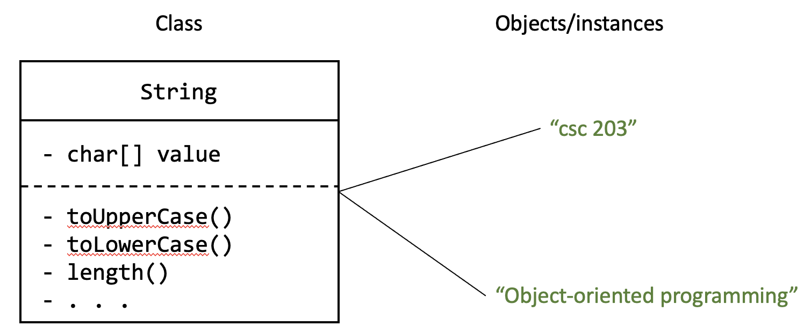

# Objects, Lists, and Maps

In this lecture we will get a first look at *Classes and objects* in Java. Following this we'll look at some classes that are available in the Java standard library, specifically *Lists* and *Maps*.

## Objects and classes 

A *class* is the blueprint that defines data each object has and what behaviours it can perform.
You can create many individual objects using the same class.
These objects are called *instances* of the class.

*Objects* are "boxes" of related pieces of data and behaviours that use those bits of data.

For example, consider the [`String` class](https://github.com/openjdk/jdk/blob/master/src/java.base/share/classes/java/lang/String.java) in Java.
If you follow that link, you'll see a lot of comments and other things that will look unfamiliar (at least for these first few weeks).
But fundamentally, the `String` class defines the following

- All `String`s have an array of characters (data).
- All `String`s have a bunch of actions they can perform using that array of characters (behaviours). For example, they can turn the characters to upper case or lower case, search the array for a specific sub-string of characters, or remove and replace specific characters with other ones.

The `String` class, by defining the data and behaviours like the above, allows us to create `String` *objects*, each of which has its own array of characters, and its own behaviours it can perform using its array of characters.

In the figure below, the (super-simplified) `String` class defines the data (`value`) and behaviours that all `String`s should have.
Then we used that class to create two *instances* of `String`, i.e., two objects.
Each of those objects have their own bit of data called `value` (in this case, an array of characters), and can perform actions using that `value`.



See the example in code:

```java
String firstString = "csc 203";
String secondString = "Object-oriented Programming";
```

The two variables `firstString` and `secondString` are both made out of the same `String` class, but they are two different objects, i.e., two distinct *instances* of the `String` class.

### Instance methods

We can tell the objects to perform certain actions. This can be done by using the *dot operator* (`.`) and saying the name of the action we want to take.

```java
String firstString = "csc 203";
String secondString = "Object-oriented Programming";

String firstUpperCased = firstString.toUpperCase();
```

After the code above runs, the `firstUpperCased` variable will have the value `"CSC 203"`, because the `toUpperCase` action gives back the value of the `String` with its characters in upper-case.

These actions can each object can perform are called *instance methods*.
Instance methods act on particular objects, or *instances* of the class.
Notice that the expression `firstString.toUpperCase()` is totally unaffected by the value of `secondString`.
Hence the name.

**What do you think would be the value of the following expressions?**

- `secondString.toUpperCase()`
- `firstString.toUpperCase().toLowerCase()`

## A code example

Consider the following class definition. It defines a class that holds data representing a cohort of CS students, and some behaviours that each cohort object can perform using its own data.

Take some time to study the code below and its accompanying annotations.[^casdoc]

[^casdoc]: Code annotating performed using [Casdoc](https://cs.mcgill.ca/~martin/casdoc/)

### Encapsulation, or, information hiding

Consider the `getYear`, `setYear`, `getEnrolled`, `getRetainedPercent`, `setRetainedPercent` methods above.
They don't do much beyond getting or setting the values of the appropriate variables.
These are called *getter methods* (or *accessors*) and *setter methods* (or *mutators*).
Because they are marked as `public` methods, they are visible to other classes, which means other classes can *get* or *set* the cohort's `year` and so on.

This should raise the question: why did we make the `year` (and other instance variables) `private` if we were going to expose access to those variables via `public` instance methods?

The answer is *encapsulation*. When we make our instance variables `private`, we hide them from the outside world. We gain the following benefits:

- **We can prevent mutations for some variables**. For example, notice that `enrolled` does not have a setter method. We simply do not allow other classes to ever modify the `enrolled` value, which we could not have done if it was `public`.
- **We can control mutations for some variables.** In the `setRetainedPercent` method, we are able to perform some validity checks before accepting a new value for the retained percent. Specifically, because this is a percentage, we check that the input value is within the range 0–1.
- **Finally, we _decouple_ our class from other classes.** By hiding these bits of information (as opposed to giving unfettered access to the internals of how our `CsCohort` works), we reduce the potential for *coupling* between our `CsCohort` class and other classes in our program.

**What's coupling?** If classes are *tightly coupled*, they have to change together. Each time one of the classes changes, it will force changes in other classes to accommodate the changes in the first class. When classes are *loosely coupled*, they are mostly independent. This does not mean they don't work together to make things happen; it just means that internals of the either of the classes can change without the other ever knowing about it.

Encapsulation helps with this. By defaulting to making our instance variables `private`, we get a lot more control over the functionality that `CsCohort` presents to other classes.

## Existing classes in Java

### Lists

### Review of arrays

- Creating a new array
- Must use the `new` keyword

### ArrayLists

- ArrayList documentation
- Arrays vs. ArrayLists: Why use ArrayLists?
- Talk about the backing array
    - But aren't arrays fixed length
    - ArrayList manages the array
    - Array has an initial capacity
    - What happens when the capacity is exceeded?

### LinkedLists

LinkedList and ArrayList, and List interface

Show the main methods for lists

- add
- remove
- contains
- get
- size (why not "length")
- isEmpty

## Maps 

- Compare to dict in python
- Simple example of `HashMap<String, String>`
- Show methods
    - put(key, value)
    - get(key)
    - getOrDefault(key)
    - entrySet()
    - isEmpty
    - containsKey()
